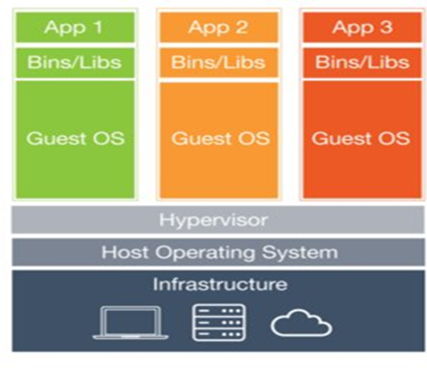
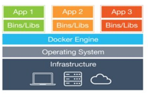
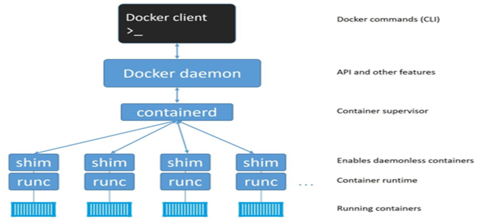
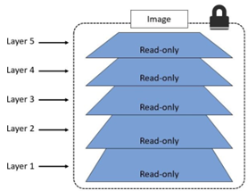
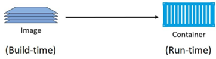
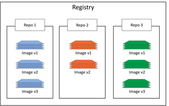
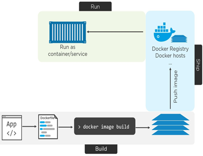
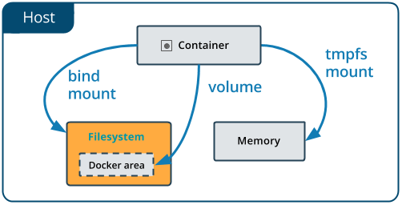

# Docker

## 1. Bad old days

- Usually one app one server rule
  - Reason were
    - Unable to judge resource requirements
    - Different infrastructure and dependencies
  - Disadvantages
    - Very costly
    - Resource wastage
    - Many servers to manage
- VMware

  

  - VMware is a company that was established in 1998 and provides different applications for virtualization
  - VMware Workstation, introduced in 1999, was the first product launched by VMware
  - Benefits came with virtualization
    - Multiple app on single server
    - Different OS and dependencies on same server using VMs
    - Much better than old one
    - Saves lot of resources
  - Disadvantages
    - OS consumes lots of resources
    - Licensing cost of every OS instance

- Hypervisor
  - A hypervisor is a function which abstracts -- isolates -- operating systems and applications from the underlying computer hardware
  - This abstraction allows the underlying host machine hardware to independently operate one or more virtual machines as guests
  - This makes it possible for multiple guest VMs to effectively share the system's physical compute resources, such as
    - Processor cycles,
    - Memory space,
    - Network bandwidth and so on
  - A hypervisor is sometimes also called a virtual machine monitor

## 2. Containers



- Container technology, also known as just a container, is a method to package an application so it can be run, with its dependencies, isolated from other processes
- For a long time, the big web-scale players like Google have been using container technologies to address these shortcomings of the VM model
- Major difference between containers and VM model
  - Single OS
    - All containers on a single host share a single OS
  - Less Hardware resource
    - This frees up huge amounts of system resources such as CPU, RAM, and storage
  - Licence fee
    - It also reduces potential licensing costs and reduces the overhead of OS patching and other maintenance
  - Portable and fast
    - Containers are also fast to start and ultra-portable
  - Once worked will work everywhere
    - Moving container workloads from your laptop, to the cloud, and then to VMs or bare metal in your data center is a breeze
- Containers result in savings on the cap-ex (Money) and op-ex (Human resource) fronts

## 3. Type of conatiners

- Linux
  - Container technology is not a new phenomenon, and has long been a core feature for Linux
  - The advance in recent years of container technology it has become easier to use, and software developers have embraced them for their simplicity, and avoiding compatibility problems
  - They also enable a program to be broken down into smaller pieces, which are known as microservices
  - Just as one example, Google Inc. has contributed many container-related technologies to the Linux kernel
  - Google is not alone, hundreds of individual developers and companies have contributed to linux kernel
  - Without these contributions, we wouldn’t have modern containers today
- Windows
  - Over the past few years, Microsoft Corp. has worked extremely hard to bring Docker and container technologies to the Windows platform
  - The core Windows technologies required to implement containers are collectively referred to as Windows Containers
  - The user-space tooling to work with these Windows Containers is Docker
  - This makes the Docker experience on Windows almost exactly the same as Docker on Linux
  - This way developers and sysadmins familiar with the Docker toolset from the Linux platform will feel at home using Windows containers
- Linux vs Windows
  - It’s vital to understand that a running container uses the kernel of the host machine it is running on
  - This means that a container designed to run on a host with a Windows kernel will not run on a Linux host
  - This means that you can think of it like this at a high level - Windows containers require a Windows Host, and Linux containers require a Linux host
  - However, it is possible to run Linux containers on Windows machines. For example, Docker for Windows (a product offering from Docker, Inc. designed for Windows 10) can switch modes between Windows containers and Linux containers
- MAC
  - There is currently no such thing as Mac containers
  - However, you can run Linux containers on your Mac using the Docker for Mac product
  - This works by seamlessly running your containers inside of a lightweight Linux VM running on your Mac
  - It’s extremely popular with developers who can easily develop and test their Linux containers on their Mac

## 4. Docker

- Docker is software that runs on Linux and Windows
- It creates, manages and also has the ability to orchestrates containers
- The software is developed as part of the Moby open-source project on GitHub
- Docker, Inc. is a company based out of San Francisco and is the overall maintainer of the open-source project
- Despite all of this, containers remained complex and outside of the reach of most organizations
- It wasn’t until Docker came along that containers were effectively democratized and accessible to the masses
- It’s would be not wrong to say that Docker made containers simple!
- When most technologists talk about Docker, they’re referring to the Docker Engine
- The Docker Engine can be downloaded from the Docker website or built from source from GitHub
- It’s available on Linux and Windows, with open-source and commercially supported offerings
- Docker, Inc. also has offers commercial versions of Docker with support contracts etc
- There two main editions:
  - Enterprise Edition (EE)
  - Community Edition (CE)

## 5. The Container Ecosystem

- Ecosystem
  - One of the core philosophies at Docker, Inc. is often referred to as Batteries included but removable
  - This is a way of saying you can swap out a lot of the native Docker stuff and replace it with stuff from 3rd parties
  - A good example of this is the networking stack that help you connect Docker container together, or connect them to non-Docker workloads
  - The core Docker product ships with built-in networking. But the networking stack is pluggable meaning you can rip out the native Docker networking and replace it with something else from a 3rd party
- OCI
  - The OCI is a relatively new governance council organized under the auspices of the Linux Foundation responsible for standardizing the most fundamental components of container infrastructure such as image format and container runtime
  - Uptil now the OCI has published two specifications (standards) -
    - The image-spec
    - The runtime-spec
  - An analogy that’s often used when referring to these two standards is rail tracks
  - Nobody wants two competing standards for rail track sizes
  - These two standards are like agreeing on standard sizes and properties of rail tracks
  - Leaving everyone else free to build better trains, better carriages, better signalling systems, better stations... all safe in the knowledge that they’ll work on the standardized tracks

## 6. Docker Installation

- Install docker running the following [script](./installDocker.sh) file
- Test docker installation using follwoing commands
  - docker --version
  - docker info
  - docker system info
  - docker version

## 7. Docker Engine

- The Docker engine is the core software that runs and manages containers
- We often refer to it simply as Docker, or the Docker platform
- The Docker engine is modular in design with many swappable components. Where possible, these are based on open-standards outlined by the Open Container Initiative (OCI).
- The Docker Engine is made from many specialized tools that work together to create and run containers - images, APIs, execution driver, runtime etc
- The major components that make up the Docker engine are: the Docker client, the Docker daemon, containerd, and runc. Together, these create and run containers
  
- The Docker daemon
  - The Docker daemon (dockerd) listens for Docker API requests and manages Docker objects such as images, containers, networks, and volumes
- runc
  - runc often refer as a container runtime
  - It has a single purpose in life is to create containers
- shim
  - The shim is integral to the implementation of daemonless containers
  - shim makes it possible to perform maintenance and upgrades on the Docker daemon without impacting running containers!
- containerd
  - containerd act as a bridge between the daemon and runc
  - It’s helpful to think of containerd as a container supervisor - the component that is responsible for container lifecycle operations such as;
    - Starting and stopping containers
    - Pausing and un-pausing them
    - Destroying the containers
  - Containerd is designed for a single task in life containerd is only interested container lifecycle operations

## 8. Images

- A Container Image is a lightweight, standalone, executable package of software that includes everything needed to run an application:
  - Code
  - Runtime
  - System tools
  - System libraries
  - Settings
- Images become containers when they run on Docker Engine
- Images are made up of multiple layers that get stacked on top of each other and represented as a single object

  

- Inside of the image is A cut-down operating system (OS) and all of the files and dependencies required to run an application
- In this way, each layer contains different things required to run a containerized app
- Common layers among different images are downloaded only once and are stored only once and get re-use in all images
- You build container based on images and that is why images are sometimes called stopped containers
- You can also create images from actual stopped containers

  

- Once a container is up and running made from an image, the two constructs become dependent on each other and you cannot delete the image until the last container using it has been stopped and destroyed
- The whole purpose of a container is to run an application
- However, containers are all about being fast and lightweight
- This means that the images they’re built from are usually small and stripped of all non-essential parts
- The official Alpine Linux Docker image is about 4MB in size and is an extreme example of how small Docker images can be
  Official Ubuntu Docker image which is currently about 120MB. These are clearly stripped of most non-essential parts

## 9. Image Registeries

- Docker images are stored in image registries
- There are many registries options are available, the most common registry is Docker Hub (https://hub.docker.com)
- Docker client is also opinionated and defaults to using Docker Hub
- Image registries contain multiple image repositories
- image repositories can contain multiple images
- It is similar that you take a example of a room, files racks and File in it, consider

  - Room as Registry
  - File racks as repositories
  - Files as images

    

- Docker Hub also has the concept of official repositories and unofficial repositories
- Official repositories contain images that have been critically examined and verified by Docker, Inc
- Most of the popular operating systems and applications have their own official repositories on Docker Hub
- Unofficial repositories are repository of normally a general users like us
- You can visit www.hub.docker.com and explore the list of official images and even sign up your own account which we will be needing to push images you created
- You can then push (upload) images you created to this account and then pull (download) it from anywhere to use it
- You can even make your uploaded images private which will not let anyone else pull it from you account

## 10. Image naming and tagging

- If you do not specify an image tag after the repository name, Docker will assume you are referring to the image tagged as latest
- The latest tag doesn’t have any magical powers! Just because an image is tagged as latest does not guarantee it is the most recent image in a repository!

## 11. Image Listing

- The image ID of any image will be unique and also remain same even if we create new image with different tag

## 12. Removing Images

- We have learned that images are use for creating a container
- We have also learned that from one particular image we can create multiple containers that runs as an instance of that image
- One important thing to remember that once you’ve started a container from an image, the two constructs become dependent on each other
- You cannot delete the image until the last container using it has been stopped and destroyed

## 13. Running a Container

- A container is the runtime instance of an image
- Technically from image you creates a copy of your app that is now up and running
- In the same way that we can start a virtual machine (VM) from a virtual machine template, we start one or more containers from a single image
- The big difference between a VM and a container is that containers are faster and more lightweight
- Instead of running a full-blown OS like a VM, containers share the OS/kernel with the host they’re running on
- You can even containerize big monolithic application but does not benefits you as it does doing microservices based application

## 14. Stopping Container

- Stopping a container does not destroy you data inside file system of container

## 15. Starting Container

## 16. Removing Container

- Removing container will now permanently delete files inside container filesystem

## 17. Container in detached mode

## 18. Publishing port

## 19. Custom container naming

## 20. Containerizing an App

- The process of taking an application and configuring it to run as a container is called “containerizing”. Sometimes we call it “Dockerizing”
- The process of containerizing an app looks like this:

  - Start with your application code
  - Create a Dockerfile that describes your app, its dependencies, and how to run it
  - Feed this Dockerfile into the docker image build command to create an image
  - Create and run a container from that image

    

## 21. Dockerfile

- Docker can build images automatically by reading the instructions from a Dockerfile
- A Dockerfile is a simple text file with instructions on how to build your images
- The Dockerfile has two main purposes:
  - To describe the application
  - To tell Docker how to containerize the application (create an image with the app inside)
- Docker file cannot be reverse engineered from any image
- This is the simplest Dockerfile to create simple HTML and JS based website

  ```Dockerfile
  FROM nginx
  COPY    .     /usr/share/nginx/html
  ```

## 22. Dockerfile complex

- Another Dockerfile example with more instruction for creating an image
- This is a typical Dockerfile required for any node.js application

  ```Dockerfile
  FROM alpine
  LABEL maintainer="aamirpinger@yahoo.com"
  RUN apk add --update nodejs nodejs-npm
  COPY      .     /src
  WORKDIR /src
  RUN npm install
  ENV CREATEDBY="Aamir Pinger"
  EXPOSE 8080
  ENTRYPOINT ["node", "./app.js"]
  ```

## 23. Containerizing App Practical Example 1

## 24. Containerizing App Practical Example 2

## 25. Pushing Images

- One of the main advantage of image is portability, meaning you can use it from anywhere in the world
- To achieve above you need to do only one thing, save your image to registry like docker hub
- This saving image is also referred as pushing image to the docker hub
- You need to sign up for the account first at https://hub.docker.com/
- After creating an account you can simply push your image to docker hub repository
- One thing important to know is for pushing an image to docker hub, we need our images to be built as username/repository:tag
- You can pull your image using docker pull from anywhere in the world and deploy with docker run command

## 26. Docker Inspect and Docker History

## 27. Bind Mount

- By default all files created inside a container are stored on a writable container layer.
- This means that the data doesn’t persist when that container no longer exists, and it can be difficult to get the data out of the container if another process needs it.
- Docker has two options for containers to store files in the host machine, so that the files are persisted even after the container stops:
  - Volumes,
  - Bind mounts
  - If you’re running Docker on Linux you can also use a tmpfs mount
- By using bind mount, a file or directory on the host machine is mounted into a container
- The file or directory is referenced by its full path on the host machine
- The file or directory does not need to exist on the Docker host already. It is created on demand if it does not yet exist
- Bind mounts are very performant, but they rely on the host machine’s filesystem having a specific directory structure available
- We will be using

  - -v or --volume tag
  - Target folder at host
  - : as a separator
  - Source folder of container

    

## 28. Bind Mount Practical Example

## 29. Docker Completed
